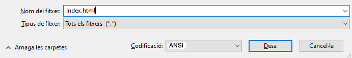
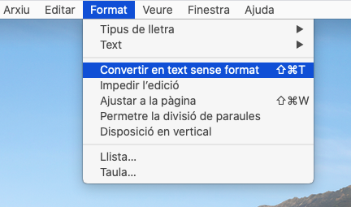
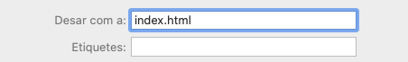

 -  Si fas servir el Bloc de notes a Windows, escriu el nom del fitxer `index.html` i selecciona en el menú desplegable de **Tipus de fitxer** l'opció **Tots els fitxers**.

  

 - Si fas servir TextEdit a Mac OS, obre un fitxer nou i, a continuació, selecciona **Format** > **Convertir en text sense format**.

  

  Assegura't de desar el fitxer com a `index.html`.

  

 - Si utilitzes Nano en una Raspberry Pi, obre una finestra del terminal, ves al directori en què vulguis crear la pàgina web i escriu `nano index.html`.

  

 - Si fas servir [CodePen](http://codepen.io){:target="_blank"}, simplement obre un "pen" nou.
