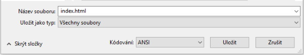
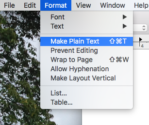

 -  Pokud používáš Poznámkový blok na systému Windows, zadej název soubor `index.html` a v rozevíracím seznamu **Uložit jako typ** klikni na možnost **Všechny soubory**.

  

 - Pokud používáš TextEdit na systému Mac OS, otevři nový soubor, klikni na **Formát** > **Převést na prostý text**.

  

  Ujisti se, že soubor ukládáš pod názvem `index.html`.

  

 - Pokud používáš Nano na Raspberry Pi, otevři okno terminálu, přesuň se do adresáře, ve kterém si přeješ vytvořit svoji webovou stránku, a napiš `nano index.html`.

  

 - If you're using [CodePen](http://codepen.io){:target="_blank"}, simply open up a new pen.
