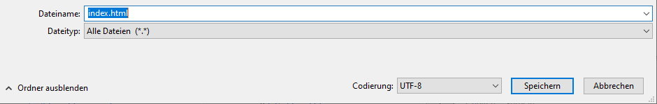
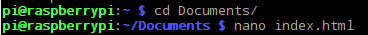

 -  Wenn du den Editor unter Windows verwendest, gib den Dateinamen `index.html` ein und wähle im Dropdown-Menü für **Dateityp** den Eintrag **Alle Dateien**.

  

 - Wenn du TextEdit unter Mac OS verwendest, öffne eine neue Datei und wähle **Format** > **In reinen Text umwandeln**.

  

  Stelle sicher, dass du die Datei als `index.html` speicherst.

  

 - Wenn du Nano auf einem Raspberry Pi verwendest, öffne ein Terminalfenster, wechsele in das Verzeichnis, in dem du deine Webseite erstellen möchtest und gib `nano index.html` ein.

  

 - Wenn du [CodePen](http://codepen.io){:target="_blank"} verwendest, öffne einfach einen neuen "Pen".
