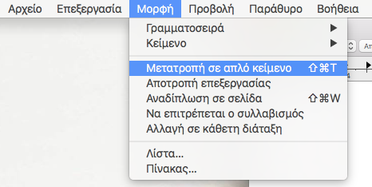

 -  Εάν χρησιμοποιείς το Σημειωματάριο στα Windows, πληκτρολόγησε το όνομα αρχείου `index.html` και άλλαξε το αναδυόμενο μενού από **Αποθήκευση ως τύπος** σε **Όλα τα αρχεία**.

  

 - Εάν χρησιμοποιείς το TextEdit σε Mac OS, άνοιξε ένα νέο αρχείο και στη συνέχεια επίλεξε **Διαμόρφωση** > **Μετατροπή σε απλό κείμενο**.

  

  Βεβαιώσου ότι έχεις αποθηκεύσει το αρχείο ως `index.html`.

  

 - Εάν χρησιμοποιείς το Nano σε ένα Raspberry Pi, άνοιξε ένα παράθυρο τερματικού, μετακινήσου στον κατάλογο στον οποίο επιθυμείς να δημιουργήσεις την ιστοσελίδα σου και πληκτρολόγησε `nano index.html`.

  

 - Εάν χρησιμοποιείς [CodePen](http://codepen.io){: target = "blank"}, απλώς άνοιξε μια νέα πένα.
