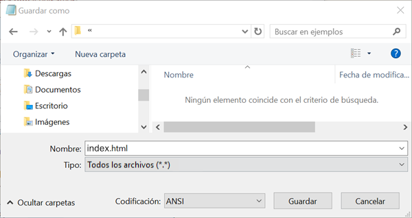

 -  Si estás utilizando el Bloc de notas en Windows, escribe en el campo "Nombre:" `index.html` y cambia en el menú desplegable **"Tipo:" ** a **Todos los archivos**.

  

 - Si está utilizando TextEdit en Mac OS, abre un nuevo archivo, luego selecciona **Formato** > **Convertir a texto sin formato**.

  

  Asegúrate de guardar el archivo como `index.html`.

  

 - Si estás utilizando Nano en tu Raspberry Pi, abre una ventana de terminal, ve al directorio en el que deseas crear tu página web y escribe `nano index.html`.

  

 - Si estás utilizando [CodePen](http://codepen.io){:target="_blank"}, simplemente crea un pen nuevo.
