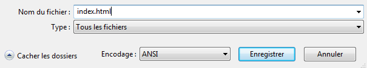
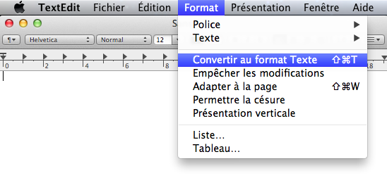
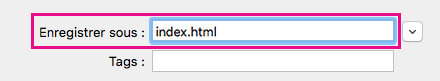

 -  Si tu utilises le Bloc-notes sous Windows, saisis `index.html` dans le champ « nom du fichier » et change dans la liste déroulante de la section **Type** sur **Tous les fichiers**.

  

 - Si tu utilises TextEdit sur Mac OS, ouvre un nouveau fichier, puis sélectionne **Format** > **Convertir au format Texte**.

  

  Assure-toi d'enregistrer le fichier en tant que `index.html`.

  

 - Si tu utilises Nano sur un Raspberry Pi, ouvre une fenêtre de terminal, accède au répertoire dans lequel tu souhaites créer ta page Web et tape `nano index.html`.

  

 - If you're using [CodePen](http://codepen.io){:target="_blank"}, simply open up a new pen.
