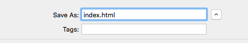

 -  यदि आप Windows पर Notepad का उपयोग कर रहे हैं, तो फ़ाइल का नाम `index.html` टाइप करें और ड्रॉप-डाउन को **Save as type** से **All files** में बदलें।

  

 - यदि आप Mac OS पर TextEdit का उपयोग कर रहे हैं, तो एक नई फ़ाइल खोलें, फिर **Format** > **Make Plain Text** को चुनें।

  

  सुनिश्चित करें कि आपने फ़ाइल को `index.html` के रूप में सेव किया है।

  

 - यदि आप Raspberry Pi पर Nano का उपयोग कर रहे हैं, तो एक टर्मिनल विंडो खोलें, उस डायरेक्टरी में जाएं जिसमें आप अपना वेबपेज बनाना चाहते हैं, और `nano index.html`टाइप करें।

  

 - If you're using [CodePen](http://codepen.io){:target="_blank"}, simply open up a new pen.
