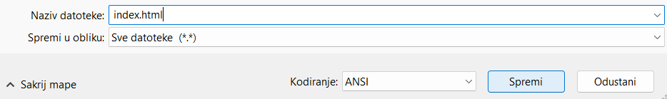

 -  Ako koristiš Blok za pisanje (Notepad) u sustavu Windows, upiši naziv datoteke `index.html` i u padajućem izborniku **Spremi u obliku** odaberi **Sve datoteke**.

  

 - Ako koristiš TextEdit u sustavu Mac OS, otvori novu datoteku, a zatim odaberi **Format** > **Izradi običan tekst**.

  

  Obavezno spremi datoteku kao `index.html`.

  

 - Ako koristiš Nano na Raspberry Pi-u, otvori prozor terminala, otvori direktorij u kojem želiš napraviti svoju web stranicu i upiši `nano index.html`.

  

 - Ako koristiš [CodePen](http://codepen.io){:target="_blank"}, jednostavno napravi novi "pen".
