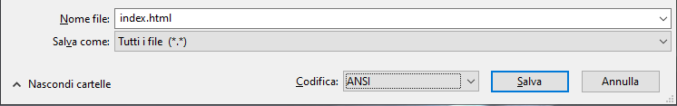
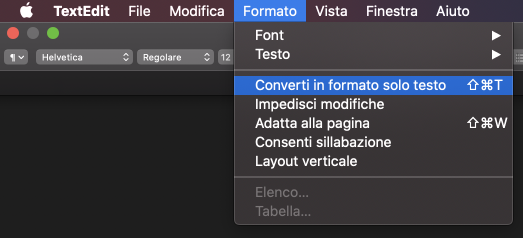
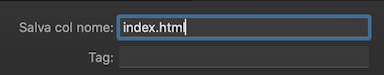

 -  Se stai usando Blocco note su Windows, digita il nome del file `index.html` e scegli **Tutti i file** dal menu a discesa **Salva come**.

  

 - Se stai utilizzando TextEdit su Mac OS, apri un nuovo file, quindi seleziona **Formato** > **Converti in formato solo testo**.

  

  Assicurati di salvare il file come `index.html`.

  

 - Se stai usando Nano su un Raspberry Pi, apri un nuovo terminale, passa alla directory in cui desideri creare la tua pagina web e digita `nano index.html`.

  

 - If you're using [CodePen](http://codepen.io){:target="_blank"}, simply open up a new pen.
