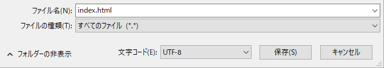

 -  Windows でメモ帳を使用している場合は、ファイル名 `index.html` を入力し、 **ファイルの種類**のドロップダウンから **すべてのファイル**を選びます。

  

 - Mac OS でテキストエディットを使用している場合は、新しいファイルを開いて、 **フォーマット** > **標準テキストにする**を選択します。

  

  ファイル名は必ず `index.html`としてください。

  

 - Raspberry Pi で Nano を使用している場合は、ターミナルウィンドウを開き、ウェブページを作成するディレクトリに移動して、 `nano index.html`と入力します。

  

 - If you're using [CodePen](http://codepen.io){:target="_blank"}, simply open up a new pen.
