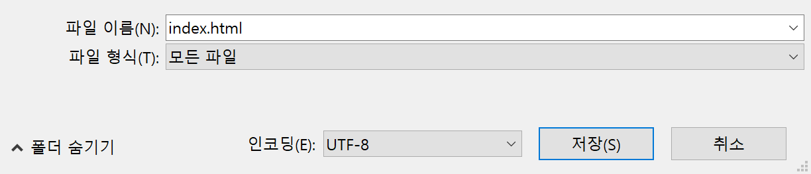
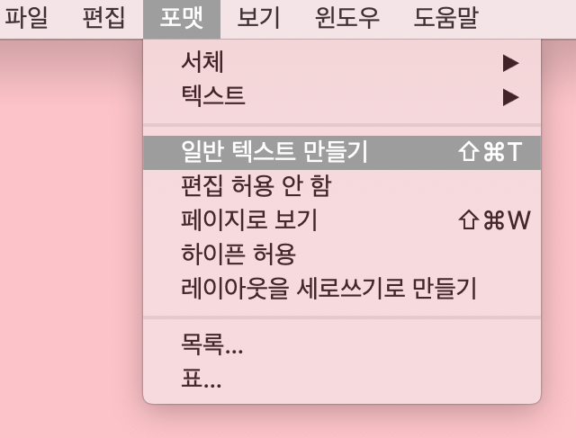
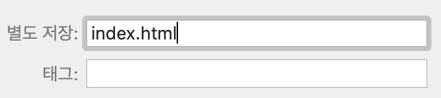

 -  Windows에서 메모장을 사용하는 경우 파일 이름 `index.html` 을 입력하고 **파일 형식**의 드롭 다운 메뉴에서 **모든 파일**로 변경하십시오.

  

 - Mac OS에서 TextEdit을 사용하는 경우 새 파일을 연 다음 **형식** > **일반 텍스트 만들기**를 선택하십시오.

  

  파일을 `index.html`로 저장하십시오.

  

 - Raspberry Pi에서 Nano를 사용하는 경우 터미널 창을 열고 웹 페이지를 만들 디렉토리로 이동 한 다음 `nano index.html`를 입력하십시오.

  

 - [CodePen](http://codepen.io){: target = "_blank"}_을 사용하는 경우 새 펜을 열면 됩니다.
