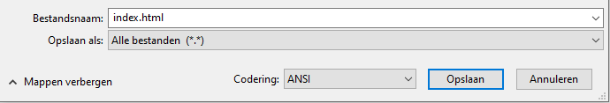

 -  Als je Kladblok op Windows gebruikt, typ dan als bestandsnaam `index.html` in en wijzig de keuzelijst voor **Opslaan als** in **Alle bestanden**.

  

 - Als je TextEdit op Mac OS gebruikt, open dan een nieuw bestand en selecteer vervolgens **Formaat** > **Maak tekst zonder opmaak**.

  

  Zorg ervoor dat je het bestand opslaat als `index.html`.

  

 - Als je Nano op een Raspberry Pi gebruikt, open dan een terminalvenster, ga naar de map waarin je je webpagina wilt maken en typ `nano index.html`.

  

 - Als je [CodePen](http://codepen.io){:target="_blank"} gebruikt, open dan gewoon een nieuwe pen.
