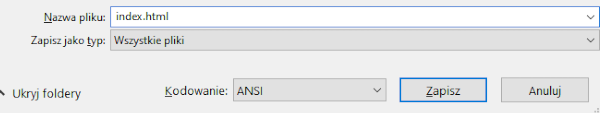

 -  Jeśli używasz Notatnika w systemie Windows, wpisz nazwę pliku `index.html` i zmień listę rozwijaną dla **Zapisz jako typ** na **Wszystkie pliki**.

  

 - Jeśli używasz TextEdit w systemie Mac OS, otwórz nowy plik, a następnie wybierz **Format** > **Utwórz zwykły tekst**.

  

  Pamiętaj, aby zapisać plik jako `index.html`.

  

 - Jeśli używasz Nano na Raspberry Pi, otwórz okno terminala, przejdź do katalogu, w którym chcesz utworzyć swoją stronę internetową, i wpisz `nano index.html`.

  

 - If you're using [CodePen](http://codepen.io){:target="_blank"}, simply open up a new pen.
