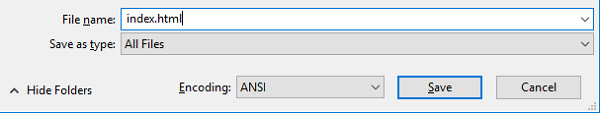

 -  Se você estiver usando o Bloco de notas no Windows, digite o nome do arquivo `index.html` e modifique o menu suspenso **Salvar como Tipo** para **Todos os arquivos**.

  

 - Se você estiver usando o TextEdit no Mac OS, abra um novo arquivo e selecione **Formato** > **Criar texto sem formatação**.

  

  Certifique-se que você salvou o arquivo como `index.html`.

  

 - Se você estiver usando o Nano em um Raspberry Pi, abra uma janela do terminal, vá para o diretório em que deseja criar sua página web e digite `nano index.html`.

  

 - Se você estiver usando [CodePen](http://codepen.io){:target="_blank"}, basta abrir uma nova caneta.
