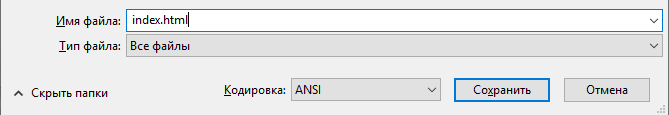
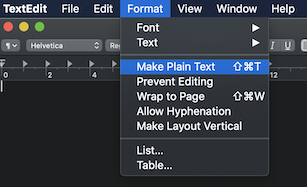
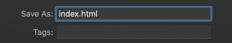

 -  Если ты используешь Блокнот на Windows, введи имя файла `index.html` и измени в выпадающем меню **Сохранить как** на **Все файлы**.

  

 - Если ты используешь TextEdit в Mac OS, открой новый файл, затем выбери **Формат** > **Сделать обычный текст**.

  

  Убедись, что ты сохранил файл как `index.html`.

  

 - Если ты используешь Nano на Raspberry Pi, открой окно терминала, перейди в каталог, в котором ты хочешь создать свою веб-страницу, и введи `nano index.html`.

  

 - Если ты используешь [CodePen](http://codepen.io){:target="_blank"}_, просто открой новый «pen».
