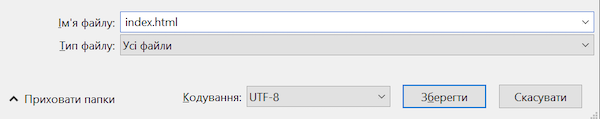
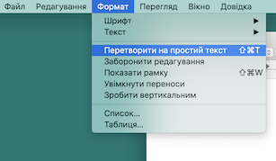
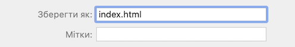

 -  Якщо ти використовуєш Блокнот (Notepad) у Windows, введи ім'я файлу `index.html` та вибери **Усі файли** у випадаючому меню **Тип файлу**.

  

 - Якщо ти використовуєш Мініредактор (TextEdit) в Mac OS, відкрий новий файл і вибери **Формат** > **Перетворити на простий текст**.

  

  Не забудь зберегти файл як `index.html`.

  

 - Якщо ти використовуєш Nano на Raspberry Pi, відкрий вікно терміналу, перейди до каталогу, в якому ти хочеш створити свою вебсторінку, і введи `nano index.html`.

  

 - If you're using [CodePen](http://codepen.io){:target="_blank"}, simply open up a new pen.
