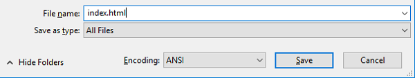

 -  如果您在 Windows 上使用记事本，请输入文件名 `index.html` 然后将 **另存为类型** 的下拉列表更改为 **所有文件**。

  

 - 如果您在 Mac OS 上使用 TextEdit，请打开一个新文件，然后选择 **格式** > **制作纯文本**。

  

  确保将文件另存为 `index.html`。

  

 - 如果您在Raspberry Pi上使用Nano，请打开终端窗口，移至要在其中创建网页的目录，然后键入` nano index.html。 ` 。

  

 - 如果您使用的是 [CodePen](http://codepen.io){:target="blank"}，只需打开一个新的 pen。
