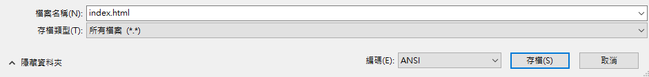
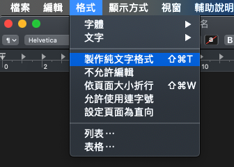
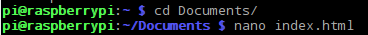

 -  如果你是在Windows上使用記事本，請在檔案名稱的欄位輸入 `index.html` 然後在 **存擋類型** 的下拉表單中選擇 **所有文件**。

  

 - 如果你是在Mac OS上使用文字編輯，請新增一個文件，然後選擇 **格式** > **製作純文字格式**。

  

  並在儲存時將文件命名存為 `index.html`。

  

 - 如果你是在Raspberry Pi使用Nano，請先打開終端機視窗，將其移動到你想創建網頁的目錄，輸入名稱 `nano index.html`。

  

 - 如果你使用的是 [ CodePen ](http://codepen.io){target="_blank"}，新增一個pen即可。
